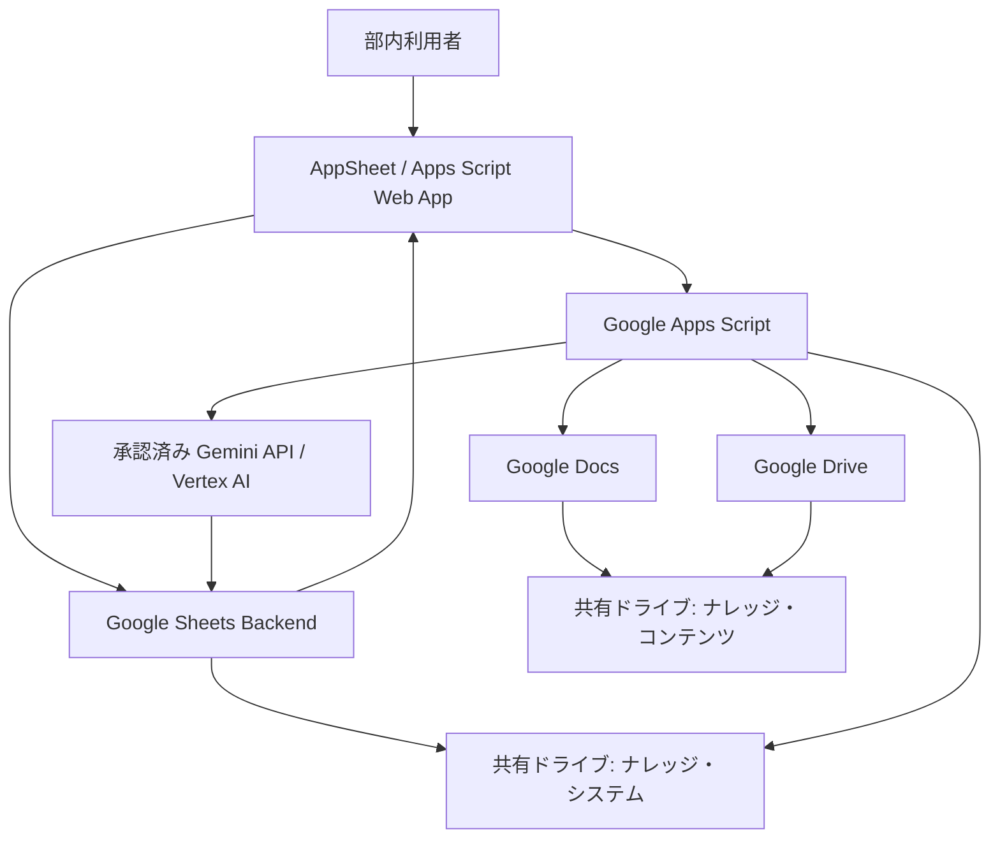
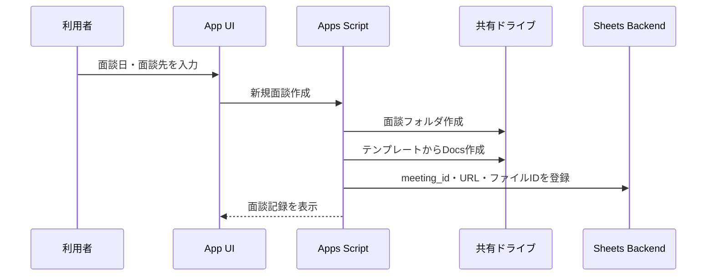

# 部内共有ナレッジ基盤：目標アーキテクチャ

作成日: 2026-08-02

ステータス: 構想・要件整理

## 1. アーキテクチャ方針

本システムは、利用者向けUI、構造化データ、原資料、業務ロジック、AI処理を分離します。

- 利用者はAppSheetまたはApps Script Web Appを操作する
- Google Sheetsは利用者から見えない索引・軽量データベースとして使う
- Google Docsを面談記録の原資料とする
- Google Driveを面談資料の原資料とする
- Google Apps Scriptでファイル作成、読込、同期、AI連携を行う
- AIは要約・抽出・検索補助に限定する
- すべての原資料をGoogle Workspaceの共有ドライブで管理する

## 2. 全体構成



## 3. コンポーネント

| コンポーネント | 役割 |
|---|---|
| AppSheet | 第一候補の利用者向けUI |
| Apps Script Web App | AppSheetが利用不可の場合の代替UI |
| Google Docs | 面談記録、自由記述、文字起こし等の原資料 |
| Google Drive | 面談資料、関連資料、生成物の保管 |
| Google Sheets | 面談、人物、組織、ファイル、ナレッジ項目の索引 |
| Google Apps Script | Docs・Drive連携、登録処理、AI処理、ログ、定期点検 |
| Gemini API / Vertex AI | 要約、項目抽出、質問検索、面談前ブリーフ生成 |
| GitHub | 設計書、ソースコード、匿名化テストデータの管理 |

## 4. 共有ドライブ構成

権限分離と運用継続性のため、コンテンツ用とシステム用の2つに分けます。

### 4.1 部内ナレッジ・コンテンツ

一般利用者がアクセスする領域です。

```text
共有ドライブ: 部内ナレッジ・コンテンツ

/01_Meeting_Notes
/02_Meeting_Materials
/03_Reference_Materials
/04_Generated_Briefs
/99_Archive
```

保存対象:

- 面談記録Docs
- 面談別資料フォルダ
- 文字起こし
- 参照資料
- 面談前ブリーフ
- 部内共有用の生成物

### 4.2 部内ナレッジ・システム

システム管理者と運用主体のみがアクセスする領域です。

```text
共有ドライブ: 部内ナレッジ・システム

/01_Data
  Backend Spreadsheet

/02_Apps
  AppSheet管理情報
  Apps Script Project

/03_Templates
  Docsテンプレート

/04_Config
  設定
  分類辞書
  プロンプト定義

/05_Logs
  処理ログ
  エラーログ

/06_Backup
  定期バックアップ
```

APIキー、認証情報、秘密値はSpreadsheetやGitHubへ保存しません。

## 5. 主なデータフロー

### 5.1 新規面談記録



### 5.2 既存Docsの登録

1. 利用者がDocs URLを登録する
2. システムがファイルの存在とアクセス権を確認する
3. 共有ドライブ内か、個人Driveか、外部所有かを判定する
4. 原則として共有ドライブへ移動またはコピーする
5. 移動・コピーできない場合は外部参照として登録し、継続性リスクを表示する
6. 元URLと保管版URLの双方を記録する

### 5.3 AI抽出

1. 処理対象DocsのファイルIDを取得する
2. AI処理許可フラグと情報区分を確認する
3. Docs本文を読み込む
4. AIへ構造化出力を要求する
5. 出力スキーマを検証する
6. AI抽出結果と原資料参照を保存する
7. 低確信項目または重要項目だけ利用者確認へ回す
8. 人が確定した項目には保護フラグを付ける

## 6. データモデル

初期バックエンドはGoogle Sheetsとし、1タブを1論理テーブルとして扱います。

### 6.1 Meetings

面談1件につき1行を保持します。

主要項目:

- meeting_id
- meeting_date
- organization_id
- title
- purpose
- owner_user_id
- meeting_doc_file_id
- materials_folder_id
- storage_status
- ai_process_allowed
- processing_status
- created_at
- updated_at

### 6.2 Organizations

GP、運用会社、投資先、アドバイザー等を管理します。

主要項目:

- organization_id
- canonical_name
- organization_type
- aliases
- active_status

### 6.3 People

社内外の人物を管理します。

主要項目:

- person_id
- canonical_name
- organization_id
- title
- role_type
- active_status

### 6.4 Meeting_People

面談と人物の多対多関係を管理します。

主要項目:

- meeting_person_id
- meeting_id
- person_id
- attendee_type
- attendance_status

### 6.5 Knowledge_Items

疑問点、事実、所感、TODO等を共通テーブルで管理します。

主要項目:

- knowledge_item_id
- meeting_id
- item_type
- item_text
- status
- owner_user_id
- due_date
- source_file_id
- source_excerpt
- generated_by
- human_confirmed
- confidence

`item_type`の初期値:

```text
FACT
INSIGHT
QUESTION
ACTION
RISK
POSITIVE
DECISION
```

### 6.6 Files

Drive上のファイル・フォルダを索引化します。

主要項目:

- file_record_id
- meeting_id
- drive_file_id
- file_type
- file_name
- file_url
- parent_folder_id
- storage_type
- access_status
- source_original_url
- last_access_check_at

### 6.7 AI_Results

AI処理履歴を保持します。

主要項目:

- ai_result_id
- meeting_id
- source_file_id
- model_name
- prompt_version
- output_schema_version
- raw_output_reference
- processed_at
- processing_status
- error_code

### 6.8 Users

利用者と権限を管理します。

主要項目:

- user_id
- email
- display_name
- role
- active_status

## 7. ナレッジカードの出力スキーマ

AI処理では、少なくとも次の形式を共通出力とします。

```json
{
  "summary": "",
  "key_topics": [],
  "facts": [],
  "statements_and_views": [],
  "observations": [],
  "open_questions": [],
  "follow_up_actions": [],
  "people": [],
  "organizations": [],
  "funds_and_strategies": [],
  "recommended_tags": [],
  "source_references": []
}
```

各抽出項目には、可能な限り原文抜粋または原資料位置情報を持たせます。

## 8. 検索アーキテクチャ

### Phase 1: 構造化検索・全文検索

- 面談先
- 人物
- ファンド
- 日付
- タグ
- Docs本文キーワード

初期段階では、Sheetsの構造化項目とDriveの全文検索を組み合わせます。

### Phase 2: AI質問検索

1. 構造化検索・全文検索で関連面談を絞る
2. 関連DocsのみをAIへ渡す
3. 回答と原資料リンクを生成する
4. 回答に面談日と出典Docsを表示する

### Phase 3: 意味検索・RAG

記録量と利用実績が増え、通常検索の限界が確認された場合に限り導入を検討します。

候補:

- Gemini File Search
- Vertex AI Search / RAG
- その他会社承認済みの検索基盤

MVPでは導入しません。

## 9. UIの切替可能性

AppSheetとApps Script Web Appのどちらでも同じ業務ロジックを使えるよう、UIと処理を分離します。

```text
UI Layer
  AppSheet または Apps Script Web App

Service Layer
  Apps Script Functions

Data Layer
  Sheets / Docs / Drive

AI Layer
  承認済みAI API
```

AppSheetの利用可否はPhase 0で確認し、次の観点で決定します。

- 社内ライセンス
- 管理者による利用許可
- 共有ドライブ対応
- 利用者数
- 権限制御
- 検索UX
- Apps Script連携
- 保守性

## 10. エラー・例外設計

想定する主な例外:

| 例外 | 対応 |
|---|---|
| Docsへのアクセス権がない | 登録を保留し、権限不足を表示 |
| ファイルが削除・移動された | access_statusを更新し、管理者へ通知 |
| 個人Driveのファイル | 共有ドライブへの移動・コピーを案内 |
| 外部所有ファイル | 継続性リスクを表示し、保管版作成を推奨 |
| AI処理失敗 | 原資料は保持し、再実行可能な状態にする |
| AI出力の形式不正 | DBへ反映せず、エラーログへ保存 |
| 同一人物・組織の重複 | ナレッジ管理者の統合キューへ送る |
| Apps Scriptクォータ超過 | バッチ分割、再試行、翌日繰越を行う |

## 11. 継続性設計

- 共有ドライブを正本とする
- 部門管理アカウントでApp・デプロイ・トリガーを管理する
- 開発・管理権限を2名以上に付与する
- ソースコードをGitHubで管理する
- プロンプト、出力スキーマ、設定にバージョンを付ける
- バックエンドデータの定期バックアップを行う
- 個人のマイドライブ、個人APIキー、個人トリガーへの依存を残さない

## 12. 将来の拡張余地

- Google Calendarから面談予定を取り込む
- 面談前ブリーフを自動生成する
- 既存タスク管理システムへ正式TODOを連携する
- GP別・人物別・ファンド別ダッシュボードを作る
- 過去面談との差分を検出する
- DD論点・質問集と面談履歴を連携する
- 記録量の増加に応じてSheetsから別のデータベースへ移行する
